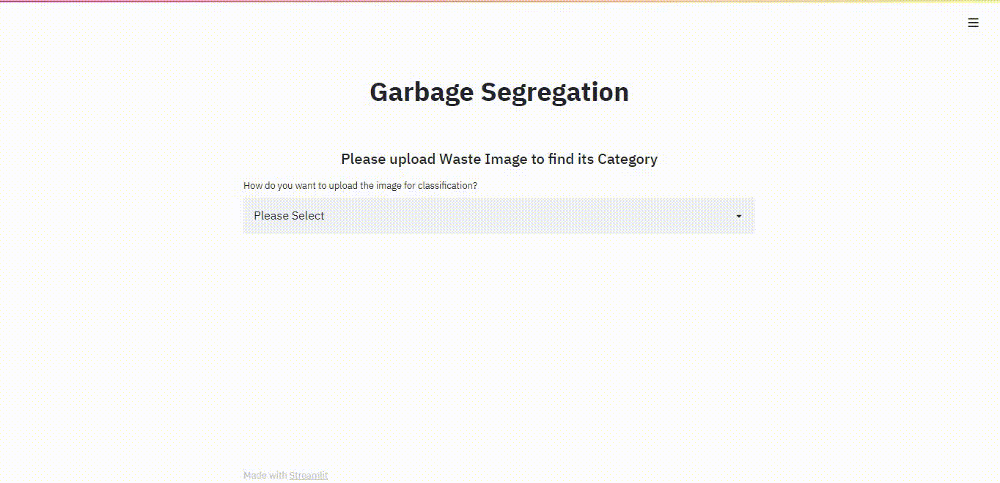

# Steps for using the Web Application
- deployment link

        https://trash-classifier-in-python-using-tensorflow-sdtrjgw4tclfkbmizs.streamlit.app/

- Cloning the Repository: 

        git clone https://github.com/Sathvik12345778/trash-classifier-y.git
- Entering The directory: 

        cd Garbage_Segregation
- Running the Web App:

        streamlit run app.py
- Stopping the web app from the terminal:

        Ctrl+C

# Demonstration
 

Here's a Demo on how the Web App works 
 
 

